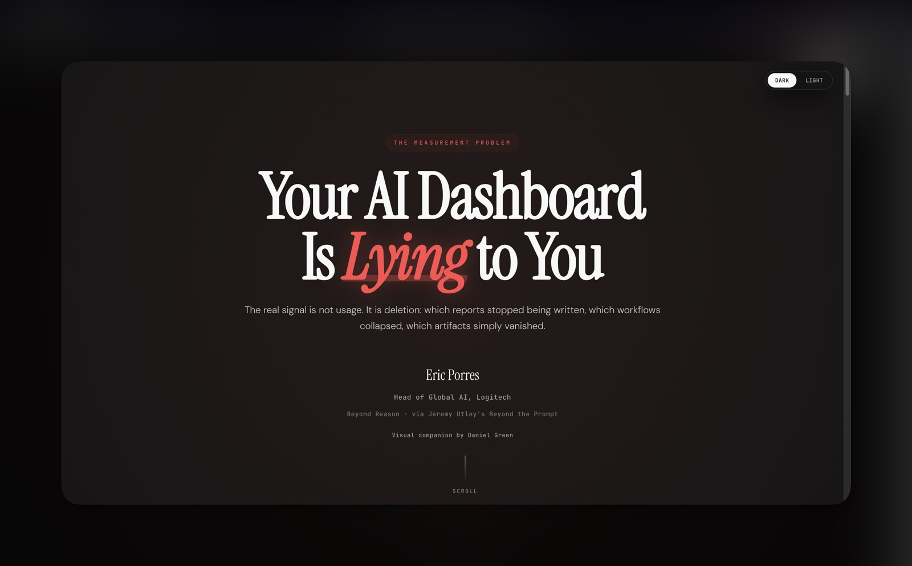

# Your AI Dashboard Is Lying

Working visual companion for Eric Porres' essay, originally published as a guest post on Jeremy Utley's blog.



## Quick Links

- Live site: <https://daniel-p-green.github.io/Your-AI-Dashboard-Is-Lying/>
- Original guest post (Jeremy's blog): <https://www.jeremyutley.com/blog/your-ai-dashboard-is-lying-to-you>
- Eric's publication on Beyond Reason: <https://promptedbyeric.substack.com/p/your-ai-dashboard-is-lying-to-you?r=2u5zyx&utm_campaign=post&utm_medium=utley&triedRedirect=true>
- Beyond the Prompt episode (April 2025): <https://podcast.beyondtheprompt.ai/episodes/eric-porres-trained-800-people-himself-now-hes-rewiring-logitechs-brain-for-the-ai-age-QvQ2mu9c>

## Changelog (Eric-Facing)

### 2026-03-04

- Hero attribution cleaned up to emphasize:
  - original guest post on Jeremy Utley's blog
  - podcast is separate and listed in Sources
- Updated profile links:
  - Eric LinkedIn: <https://www.linkedin.com/in/eporres/>
  - Jeremy LinkedIn: <https://www.linkedin.com/in/jeremyutley/>
- Closing section typography and hierarchy strengthened:
  - larger "The bridge is not..." lead
  - larger "Your AI dashboard..." closing sentence
  - cleaner alignment and line wrapping
- Accessibility and UX improvements:
  - improved light-mode link contrast
  - semantic `<main id="main-content">` landmark
  - persisted theme choice (dark/light)
  - smooth scroll now also moves focus for keyboard/screen-reader flow

## Basics

### Local Preview

```bash
python3 -m http.server 8000
```

Open: <http://localhost:8000>

### Deploy

GitHub Pages serves directly from the `main` branch root.
Push to `main` to publish updates.

### Main Files

- `index.html`: full page content, styles, and behavior
- `assets/thumbnail.jpg`: compressed README preview image
